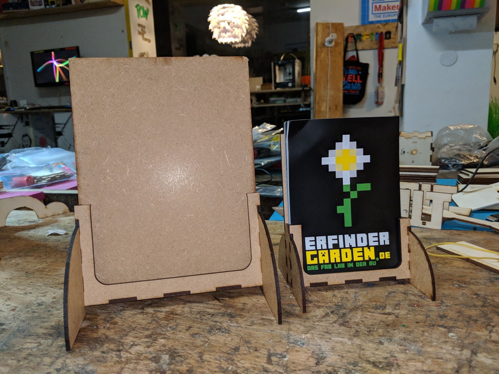
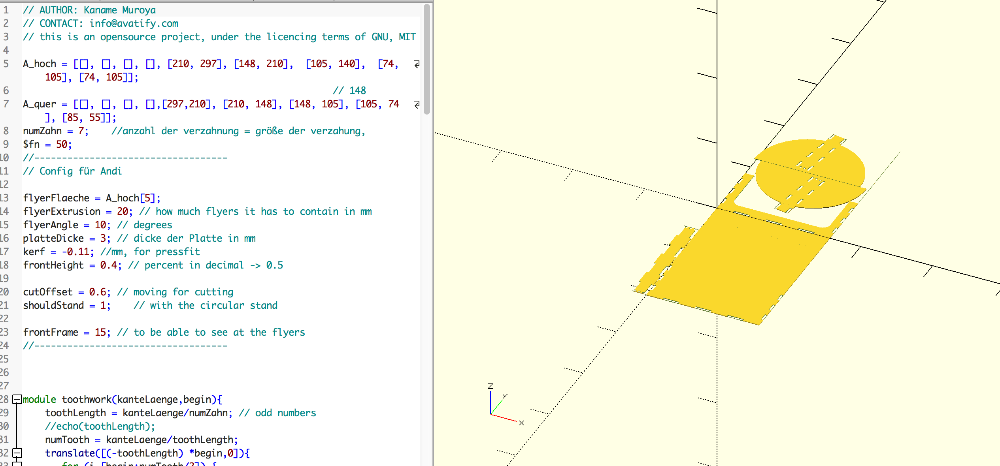

# parametrischer Flyer Halter (A6, A5, A4, Visitenkarten)
## parametric Flyer holder

Kenny designed a nice flyer holder in openscad. 

It is parametric and can be adjusted for wallmount and as a desktop stand. 

It comes in sizes A6, A5, A4 and to hold your business cards.

## How you can help?

* lasercut the design yourself
* share your makes with us at 
* buy one and support erfindergarden

## Designer

Kaname Muroya

[kenny@erfindergarden.de](mailto:kenny@erfindergarden.de)

## Contact erfindergarden

Andreas Kopp

[andreas@erfindergarden.de](mailto:andreas@erfindergarden.de)

[www.erfindergarden.de](http://www.erfindergarden.de)
[www.facbebook.com/erfindergarden](http://www.facbebook.com/erfindergarden)

## Credits
 
Thanks Kenny for the design. 

## Licence

This project is [Attribution-ShareAlike 2.5 Generic (CC BY-SA 2.5)](https://creativecommons.org/licenses/by-sa/2.5/). You can do anything what you want with it but please say that you got the original design from erfindergarden and als share it under the same license. 

For more information, see [license](license.md). 